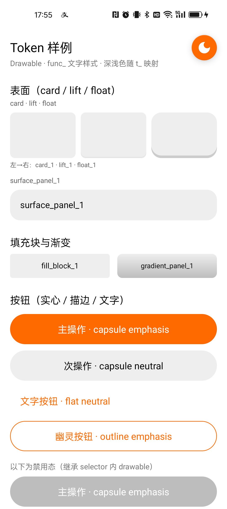
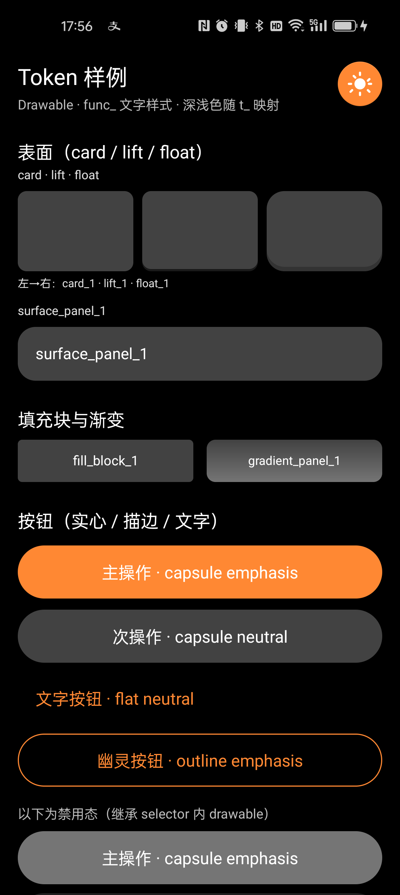
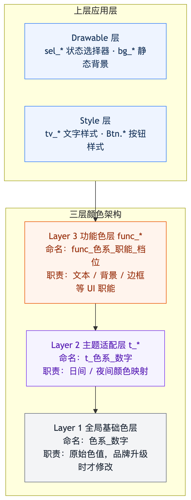

# arch_ui_token_spec

一套可落地的 **现代化 UI 资源架构** 参考实现：以 Android 为载体，通过三层颜色体系、Drawable 规范与 Style 复用，解决颜色混乱、主题切换成本高、样式冗余等常见问题。

> 核心思想适用于 iOS、React、H5、小程序等任意平台；本仓库以 Android XML 资源作为示例。

## 运行效果

内置 **Token 样例页**（`activity_token_showcase`），用于对照资源命名与真机效果。右上角 FAB 可切换深浅色；**同一套** `func_*` / Drawable / Style **无需改业务代码**，仅由 `values-night` 中 `t_*` 映射驱动换肤。

| 日间 | 夜间 |
|:---:|:---:|
|  |  |

## 架构概览

<p align="center">
  
</p>

| 层级 | 职责 | 典型命名 |
|------|------|----------|
| **基础色** | 原始色值，品牌升级时才改 | `black_8`、`orange_4` |
| **主题适配** | 日间/夜间映射，在 `values-night` 覆写 | `t_black_8` |
| **功能色** | 按 UI 职能抽象（文本/背景/边框等） | `func_black_text_1` |
| **Drawable** | 统一形态与交互状态 | `bg_gray_surface_page_1`、`sel_orange_interact_capsule_emphasis_default` |
| **Style** | 消除重复属性，提升复用 | `tv_title_1`、`Widget.Btn.Orange.Capsule.Emphasis` |

依赖方向严格单向：**应用层 → `func_*` → `t_*` → 基础色**。

## 文档

完整方法论见 `doc/` 目录下的系列文章（建议按顺序阅读）：

| 篇目 | 主题 |
|------|------|
| [ui_architecture1.md](doc/ui_architecture1.md) | 三层颜色体系与系统化设计方案 |
| [ui_architecture2.md](doc/ui_architecture2.md) | Drawable 层规范与工程实践 |
| [ui_architecture3.md](doc/ui_architecture3.md) | Style 层如何系统性消除代码冗余 |
| [ui_architecture4.md](doc/ui_architecture4.md) | 设计主权回归与团队落地 |

## 项目结构

```
arch_ui_token_spec/
├── doc/                          # 架构系列文档
├── screenshot/                   # 架构图、日间/夜间运行截图
└── app/src/main/res/
    ├── values/
    │   ├── colors_primitives.xml   # Layer 1：基础色
    │   ├── colors_theme_tokens.xml # Layer 2：主题 token（日间）
    │   ├── colors_semantic.xml     # Layer 3：func_* 功能色
    │   ├── styles_tv.xml           # 文字样式
    │   ├── styles_button.xml       # 按钮样式
    │   ├── dimens_drawable.xml     # Drawable 圆角等尺寸
    │   └── themes.xml
    ├── values-night/
    │   └── colors_theme_tokens.xml # 夜间 t_* 覆写
    ├── drawable/                   # bg_* / sel_* 资源
    └── layout/
        └── activity_token_showcase.xml
```

## 快速开始

### 环境要求

- Android Studio（推荐最新稳定版）
- JDK 11+
- Android SDK（`compileSdk` 36，`minSdk` 16）

### 构建与安装

```bash
./gradlew installDebug
```

或在 Android Studio 中打开工程，运行 `app` 模块。

启动后进入 Token 样例页；点击右上角浮动按钮即可在日间/夜间模式间切换。

## 关于本 Demo

本仓库的 Android 工程是**抛砖引玉的参考实现**，价值在于方法论而非覆盖全部业务场景：

- **颜色**：仅实现常用 token 子集；矩阵补全、新增档位由设计师在资源文件中维护
- **Drawable**：覆盖按钮、输入框等基础组件状态；列表、弹窗等复杂场景需按产品扩展
- **组件**：演示表面层级、填充/渐变、按钮形态与禁用态等；业务页面需自行接入同一套命名规范

## 相关链接

- 仓库：<https://github.com/zealot2002/arch_ui_token_spec>
