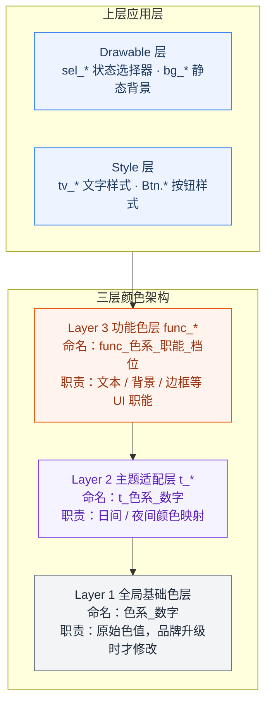
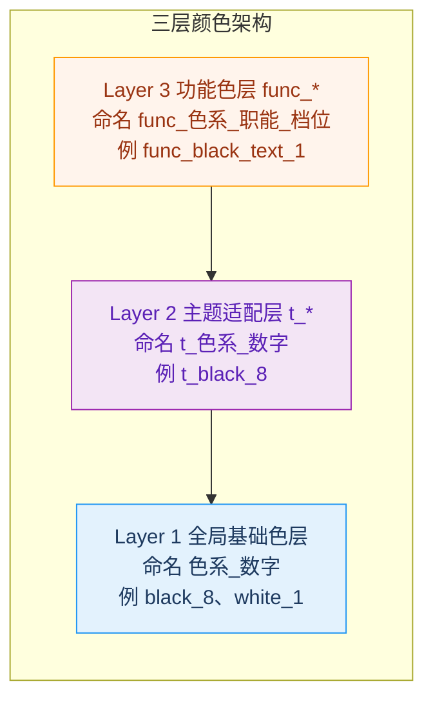

# 现代化 UI 架构：三层颜色体系与系统化设计方案

> 本文是 **UI 架构系列** 的第一篇，将深入探讨颜色层的设计。后续文章将依次介绍：
> - [第二篇：Drawable 层的规范设计](ui_architecture2.md)
> - [第三篇：Style 层的工程化实践](ui_architecture3.md)
> - [第四篇：架构总结与设计主权回归](ui_architecture4.md)

> **注**：本文以 Android 为例进行说明，但核心思想完全适用于 iOS、React、H5、小程序等任何平台。

---

## 前言

在多年的跨平台 App 开发实践中，我发现 UI 资源管理是困扰许多团队的共性问题：
- 颜色定义混乱，同一个色值重复定义几十次
- 组件形态与颜色过度耦合，难以复用
- 样式属性重复书写，维护成本极高
- 主题切换困难，夜间模式适配工作量巨大
- 新同事需要花费大量时间理解混乱的颜色命名

如果你也被这些问题困扰，这个系列或许值得一读——主要面向设计总监、设计师、研发总监与前端工程师。

**本文要点**：
1. 三层颜色架构的设计理念和核心原则
2. 每一层的具体设计规范和代码实现
3. 如何实现日间/夜间模式的无缝切换
4. 架构的适用场景和扩展方向

### 架构全景

本系列介绍的是一套完整的 **UI 架构体系**，其中**三层颜色架构**是核心基础：



*箭头表示引用/依赖方向：应用层引用 func_*；func_* 引用 t_*；t_* 引用基础色。定义权在设计侧，自下而上配置。*

**颜色层依赖关系**：`func_*` → `t_*` → 基础色（严格单向依赖）

**本文聚焦于三层颜色架构的完整设计**，后续文章将介绍上层应用层如何基于颜色层构建。

---

## 一、传统颜色管理的核心痛点

### 1.1 真实项目中的反例

在我接触过的多个项目中，经常会看到类似这样的颜色定义：

```xml
<!-- 从真实项目中截取的颜色定义 -->
<color name="bg_login">#FFFFFF</color>      <!-- 登录页背景 -->
<color name="bg_home">#F5F5F5</color>      <!-- 首页背景 -->
<color name="bg_profile">#FFFFFF</color>    <!-- 个人中心背景 -->
<color name="text_title">#141414</color>   <!-- 标题文字 -->
<color name="text_desc">#808080</color>    <!-- 描述文字 -->
<color name="text_hint">#BFBFBF</color>    <!-- 提示文字 -->
<color name="button_red">#DB121F</color>   <!-- 红色按钮 -->
<color name="red_button">#DB121F</color>   <!-- 另一个红色按钮 -->
```

### 1.2 问题分析

| 问题类型 | 具体表现 | 影响 |
|---------|---------|------|
| **重复定义** | `#FFFFFF` 和 `#DB121F` 多次出现 | 改一处需改所有地方，容易遗漏 |
| **业务绑定** | `bg_login`、`bg_home` 与具体页面绑定 | 无法复用，扩展性差 |
| **命名混乱** | `button_red` 和 `red_button` 同时存在 | 新人难以选择，团队协作困难 |
| **夜间模式灾难** | 需复制所有颜色到 `values-night` | 工作量巨大，容易出错 |

### 1.3 根本原因

这些问题的本质在于：**颜色定义与业务语义、主题逻辑过度耦合**。当一个颜色既承载了"背景"的业务含义，又承载了"白色"的具体色值时，任何改动都会牵一发而动全身。

---

## 二、三层颜色架构设计理念

针对这些问题，我设计了一套**严格单向依赖**的三层颜色架构：



### 2.1 架构核心原则

| 层级 | 唯一职责 | 命名规则 | 是否承载业务语义 | 修改频率 |
|------|----------|----------|----------------|----------|
| **基础色层** | 定义原始色值 | `色系_数字`（如 `white_1`） | ❌ 否 | 极低（品牌升级时才改） |
| **主题层** | 日间/夜间模式映射 | `t_色系_数字`（如 `t_white_1`） | ❌ 否 | 低（新增主题时才改） |
| **功能色层** | UI 职能封装（文本、背景、边框等） | `func_{色系}_{职能}_{档位}`（如 `func_black_text_1`） | ❌ 否 | 由设计师维护（新增档位/职能时改） |

**重要说明**：功能色层封装的是 **UI 职能**（如文本、背景、边框），而非具体业务场景。`func_black_text_1` 代表黑色系主档文本色，可用于商品标题、页面标题、按钮文字等任何场景，不绑定具体业务。**功能色的定义权归属设计师**，研发只引用、不新增。

### 2.2 严格单向依赖规则

```
基础色层 → 主题层 → 功能色层
    ↑         ↑         ↑
   改色      换肤     改职能
```

**为什么必须严格遵守单向依赖？**
- 避免循环依赖导致的颜色定义混乱
- 每层只做自己的事，职责清晰，便于定位问题
- 改一处全局生效，维护成本极低
- 多人开发不会互相冲突

---

## 三、分层详解：每一层该怎么设计

### 3.1 第一层：全局基础色层

**定位**：纯原始色值定义，不做任何主题绑定和业务关联

**命名规则**：`色系_数字` 下划线格式，数字按明度/饱和度递增

**设计原则**：
- 白色系：数字越小越浅（`white_1` = 纯白）
- 黑色系：数字越小越浅（`black_1` = 浅灰）
- 彩色系：数字越小饱和度越低
- 不参与日夜切换，保持绝对稳定

**完整基础色表**（与仓库实现一致）：

| 色系 | 档位数 | 命名区间 / 说明 |
|------|--------|----------------|
| 白色系 | 4 | `white_1` ~ `white_4` |
| 黑色系 | 8 | `black_1` ~ `black_8` |
| 灰色系 | 7 | `gray_1` ~ `gray_7` |
| 红色系 | 4 | `red_1` ~ `red_4` |
| 橙色系 | 4 | `orange_1` ~ `orange_4`；含 `orange_0`、`orange_2b`、`orange_3b` |
| 黄色系 | 4 | `yellow_1` ~ `yellow_4` |
| 蓝色系 | 4 | `blue_1` ~ `blue_4` |
| 绿色系 | 4 | `green_1` ~ `green_4` |
| 补间色 | 按需 | 如 `black_5a` |
| 透明度变体 | 按需 | `基础色名_alpha{透明度}` |

**代码示例**：

```xml
<!-- ✅ 正确：统一色系_数字命名 -->
<color name="white_1">#FFFFFF</color>
<color name="black_8">#000000</color>
<color name="red_4">#DB121F</color>
<color name="black_1">#F0F0F0</color>
<color name="white_1_alpha20">#33FFFFFF</color>
```

### 3.2 第二层：主题适配层（t_）

**定位**：唯一的日夜模式映射层，只做色值代理，不承载任何业务语义

**命名规则**：`t_基础色名`，与基础色一一对应

**设计原则**：
- 只引用基础色层变量，绝对不写具体色值
- 日间/夜间模式通过 Android 资源限定符自动切换
- 保持与基础色完全一致的命名，便于维护

**错误做法（常见误区）**：

```xml
<!-- ❌ 错误：主题层承载了业务语义 -->
<!-- values/colors.xml -->
<color name="t_bg_page">#FFFFFF</color>
<color name="t_text_main">#000000</color>

<!-- values-night/colors.xml -->
<color name="t_bg_page">#141414</color>
<color name="t_text_main">#FFFFFF</color>
```

**问题**：主题层承载了业务语义，破坏了分层原则。新增主题时需要复制所有业务语义的颜色。

**正确做法**：

```xml
<!-- ✅ 正确：只做颜色映射，不关心用途 -->
<!-- values/colors_theme_tokens.xml（日间模式） -->
<color name="t_white_1">@color/white_1</color>
<color name="t_black_8">@color/black_8</color>
<color name="t_orange_4">@color/orange_4</color>

<!-- values-night/colors_theme_tokens.xml（夜间模式） -->
<color name="t_white_1">@color/black_8</color>   <!-- 背景色反转 -->
<color name="t_black_8">@color/white_1</color>   <!-- 主文字色反转 -->
<color name="t_orange_4">@color/orange_3b</color> <!-- 夜间使用较浅的橙色 -->
```

**优势**：
- 主题层只做颜色映射，不关心用途
- 新增主题只需要加一个资源目录
- 夜间模式切换完全由 Android 系统自动处理，零代码侵入

### 3.3 第三层：功能色层（func_）

**定位**：面向 UI 职能的语义抽象层，**不承载业务语义**（如「登录页背景」「删除按钮红」）

**命名规则**：`func_{色系}_{职能}_{档位}`，档位数字按该职能下的深浅/重要性递增

**设计原则**：
- 只引用主题层变量，绝对不直接引用基础色
- 采用「色系 × 职能 × 数字档位」模式，保留无限扩展能力
- **由设计师在资源文件中定义与维护**；研发在布局/代码中只引用已有 token

**为什么我反对固定语义命名？**

很多人喜欢这样定义功能色：
```xml
<color name="func_text_main">@color/t_black_8</color>
<color name="func_text_sub">@color/t_black_5</color>
<color name="func_text_aux">@color/t_black_3</color>
```

**这在实际项目中会出问题**：中间态越来越多，命名很快失控。比如需要一个介于 `sub` 和 `aux` 之间的颜色时，该叫 `func_text_sub2` 还是 `func_text_medium`？

**最佳实践：色系 + 职能 + 数字档位**

```xml
<!-- 黑色系文本：档位越小越深、越重要 -->
<color name="func_black_text_1">@color/t_black_8</color>
<color name="func_black_text_2">@color/t_black_7</color>
<color name="func_black_text_3">@color/t_black_5</color>
<color name="func_black_text_4">@color/t_black_3</color>

<!-- 黑色系背景：档位越小越浅 -->
<color name="func_black_bg_1">@color/t_black_8</color>
<color name="func_black_bg_2">@color/t_black_7</color>

<!-- 橙色系强调 -->
<color name="func_orange_text_1">@color/t_orange_4</color>
<color name="func_orange_bg_1">@color/t_orange_4</color>
```

**无限扩展能力**：
- 需要在 `func_black_text_2` 与 `func_black_text_3` 之间加一档，由设计师新增 `func_black_text_25` 即可
- 不用造 `func_product_title` 这类业务名
- 规范可长期稳定

**职能分类速览**（详见第六节完整矩阵）：

| 职能后缀 | 命名示例 | 典型用途 |
|----------|----------|----------|
| `_text` | `func_black_text_1` | 各级文字 |
| `_bg` | `func_gray_bg_1` | 页面、卡片背景 |
| `_border` | `func_gray_border_1` | 边框 |
| `_divider` | `func_black_divider_1` | 分割线 |
| `_alpha` | `func_black_alpha_1` | 遮罩、半透明 |
| `_shadow` | `func_black_shadow_1` | 阴影 |

---

## 四、两个关键争议点的深度解析

### 4.1 争议1：主题层到底该不该承载业务语义？

**我的答案：绝对不应该**。

主题层的本质是**颜色代理**，它的唯一职责是根据当前主题返回对应的基础色。它不应该关心这个颜色是用来做背景还是文字。

如果主题层承载了业务语义：
- 每新增一个主题，你都要复制所有业务语义的颜色
- 业务语义变化时，你需要修改所有主题文件
- 架构的解耦性被完全破坏

### 4.2 争议2：功能层用数字命名会不会可读性差？

**不会，只要约定好规则**。

我们只需要在团队内部约定：
- 文本色：数字越小越重要、越深
- 背景色：数字越小越浅
- 边框色：数字越小越深

新人只需要花 5 分钟就能记住这些规则，比记住几十个不同的语义名称要容易得多。

---

## 五、核心优势：为什么这套架构能解决问题？

### 5.1 维护成本显著降低

**改色流程对比**：

| 操作 | 传统做法 | 三层架构 |
|------|----------|----------|
| 改品牌色 | 全局搜索替换几百个地方 | 修改基础色层一处 |
| 适配夜间模式 | 修改所有颜色定义 | 自动切换，零代码 |
| 新增页面 | 定义 5-10 个新颜色 | 复用设计师已定义的功能色 |

### 5.2 无限扩展能力

- 新增色系：只需要在基础色层添加
- 新增主题：只需要加一个资源目录
- 新增 UI 职能档位：由设计师在功能层顺延数字编号

### 5.3 团队协作零成本

- 统一的命名规范，没有歧义
- 新成员 5 分钟就能上手
- 多人开发不会互相冲突

---

## 六、功能色层详解：7大色系 × 6种职能

在实际项目中，我们发现一个 App 中常用的颜色职能只需要**6种**：

| 职能 | 用途 | 示例 |
|------|------|------|
| **文本色** | 文字显示 | 标题、正文、辅助文字 |
| **背景色** | 填充区域 | 页面背景、卡片背景 |
| **边框色** | 勾勒边界 | 输入框边框、卡片边框 |
| **分割线** | 分隔内容 | 列表分割线、区域分隔 |
| **透明度** | 半透明效果 | 遮罩、玻璃效果 |
| **阴影色** | 阴影效果 | 卡片阴影、按钮阴影 |

而这 6 种职能，组合**7大色系**，就构成了一个完整的颜色体系。

### 6.1 为什么是这7大色系？

| 色系 | 特点 | 主要用途 |
|------|------|----------|
| **黑色系** | 从纯黑到浅灰的完整灰阶 | 正文、次要文字、背景 |
| **灰色系** | 独立的灰色梯度 | 辅助信息、禁用状态 |
| **红色系** | 高饱和度警示色 | 错误、删除、警告 |
| **黄色系** | 温和警示色 | 待处理、进行中 |
| **橙色系** | 强调色 | 热销、促销、主按钮 |
| **蓝色系** | 信任色 | 链接、信息、成功 |
| **绿色系** | 正向色 | 成功、增长、完成 |

### 6.2 完整颜色矩阵

**文本色（7色系 × 4档 = 28个）**：

| 色系 | 命名 | 深浅/饱和度 |
|------|------|------------|
| 黑色系 | `func_black_text_1` ~ `func_black_text_4` | 1最深 → 4最浅 |
| 灰色系 | `func_gray_text_1` ~ `func_gray_text_4` | 1最深 → 4最浅 |
| 红色系 | `func_red_text_1` ~ `func_red_text_4` | 1高饱和 → 4低饱和 |
| 黄色系 | `func_yellow_text_1` ~ `func_yellow_text_4` | 1高饱和 → 4低饱和 |
| 橙色系 | `func_orange_text_1` ~ `func_orange_text_4` | 1高饱和 → 4低饱和 |
| 蓝色系 | `func_blue_text_1` ~ `func_blue_text_4` | 1高饱和 → 4低饱和 |
| 绿色系 | `func_green_text_1` ~ `func_green_text_4` | 1高饱和 → 4低饱和 |

**背景色（7色系 × 2档 = 14个）**：

| 色系 | 命名 | 用途 |
|------|------|------|
| 黑色系 | `func_black_bg_1`, `func_black_bg_2` | 深色背景 |
| 灰色系 | `func_gray_bg_1`, `func_gray_bg_2` | 浅灰背景、卡片 |
| 红色系 | `func_red_bg_1`, `func_red_bg_2` | 错误背景 |
| 黄色系 | `func_yellow_bg_1`, `func_yellow_bg_2` | 警告背景 |
| 橙色系 | `func_orange_bg_1`, `func_orange_bg_2` | 强调背景 |
| 蓝色系 | `func_blue_bg_1`, `func_blue_bg_2` | 信息背景 |
| 绿色系 | `func_green_bg_1`, `func_green_bg_2` | 成功背景 |

**边框色（7色系 × 2档 = 14个）**：

| 色系 | 命名 | 用途 |
|------|------|------|
| 黑色系 | `func_black_border_1`, `func_black_border_2` | 常规边框 |
| 灰色系 | `func_gray_border_1`, `func_gray_border_2` | 辅助边框 |
| 红色系 | `func_red_border_1`, `func_red_border_2` | 错误边框 |
| 黄色系 | `func_yellow_border_1`, `func_yellow_border_2` | 警告边框 |
| 橙色系 | `func_orange_border_1`, `func_orange_border_2` | 强调边框 |
| 蓝色系 | `func_blue_border_1`, `func_blue_border_2` | 信息边框 |
| 绿色系 | `func_green_border_1`, `func_green_border_2` | 成功边框 |

**分割线、透明度、阴影色**（各7色系 × 2档 = 各14个）：

| 色系 | 分割线命名 | 透明度命名 | 阴影命名 |
|------|-----------|-----------|---------|
| 黑色系 | `func_black_divider_1~2` | `func_black_alpha_1~2` | `func_black_shadow_1~2` |
| 灰色系 | `func_gray_divider_1~2` | `func_gray_alpha_1~2` | `func_gray_shadow_1~2` |
| 红色系 | `func_red_divider_1~2` | `func_red_alpha_1~2` | `func_red_shadow_1~2` |
| 黄色系 | `func_yellow_divider_1~2` | `func_yellow_alpha_1~2` | `func_yellow_shadow_1~2` |
| 橙色系 | `func_orange_divider_1~2` | `func_orange_alpha_1~2` | `func_orange_shadow_1~2` |
| 蓝色系 | `func_blue_divider_1~2` | `func_blue_alpha_1~2` | `func_blue_shadow_1~2` |
| 绿色系 | `func_green_divider_1~2` | `func_green_alpha_1~2` | `func_green_shadow_1~2` |

**理论矩阵规模：7 色系 × 6 职能 × 2–4 档 ≈ 84 个 token**，可覆盖绝大多数通用 UI 场景。本仓库 demo 仅实现常用子集（见 `colors_semantic.xml`）；完整矩阵由设计师按产品需要逐步补齐，研发不自行「补色」。

### 6.3 核心原则：职能无关，业务通用

这套颜色体系是**业务无关**的。同一个 `func_red_text_1`：
- 在电商 App 中可以用作「商品下架」提示
- 在社交 App 中可以用作「被拉黑」提示
- 在金融 App 中可以用作「交易失败」提示

颜色本身不承载业务语义，业务语义由**使用场景**决定。

### 6.4 反例 vs 正例

**反例：业务绑定**
```xml
<!-- ❌ 错误：业务绑定，无法复用 -->
<color name="func_product_delete_text">@color/t_red_5</color>    <!-- 商品删除文字 -->
<color name="func_order_cancel_text">@color/t_red_5</color>    <!-- 订单取消文字 -->
```

**正例：职能无关**
```xml
<!-- ✅ 正确：职能无关，业务通用 -->
<color name="func_red_text_1">@color/t_red_5</color>    <!-- 任何需要红色文字的地方 -->
<color name="func_red_text_2">@color/t_red_4</color>    <!-- 任何需要浅红文字的地方 -->
```

### 6.5 完整命名规范速查表

**命名公式**：`func_{色系}_{职能}_{档位}`

**色系前缀**：

| 前缀 | 色系 | 示例 |
|------|------|------|
| `black` | 黑色系 | `func_black_text_1` |
| `gray` | 灰色系 | `func_gray_text_1` |
| `red` | 红色系 | `func_red_text_1` |
| `yellow` | 黄色系 | `func_yellow_text_1` |
| `orange` | 橙色系 | `func_orange_text_1` |
| `blue` | 蓝色系 | `func_blue_text_1` |
| `green` | 绿色系 | `func_green_text_1` |

**职能后缀**：

| 后缀 | 职能 | 档位 |
|------|------|------|
| `_text` | 文本色 | 1-4档 |
| `_bg` | 背景色 | 1-2档 |
| `_border` | 边框色 | 1-2档 |
| `_divider` | 分割线 | 1-2档 |
| `_alpha` | 透明度 | 1-2档 |
| `_shadow` | 阴影色 | 1-2档 |

---

## 七、总结

这套三层颜色架构的核心思想其实很简单：**解耦**。

- 把色值定义和主题适配解耦
- 把主题适配和 UI 职能语义解耦（职能语义仍由设计师定义，不绑定具体业务页面）
- 每一层只做自己最擅长的事

通过「7大色系 × 6种职能」的设计，我们构建了一套完整、可扩展、业务无关的颜色体系，覆盖 App 所有通用 UI 场景。

---

**参考代码**：
- [基础色定义](https://github.com/zealot2002/arch_ui_token_spec/blob/main/app/src/main/res/values/colors_primitives.xml)
- [日间主题层](https://github.com/zealot2002/arch_ui_token_spec/blob/main/app/src/main/res/values/colors_theme_tokens.xml)
- [夜间主题层](https://github.com/zealot2002/arch_ui_token_spec/blob/main/app/src/main/res/values-night/colors_theme_tokens.xml)
- [功能色定义](https://github.com/zealot2002/arch_ui_token_spec/blob/main/app/src/main/res/values/colors_semantic.xml)

> 💡 如果你觉得这篇文章对你有帮助，欢迎点赞、收藏、转发。关注我，获取更多 Android 架构设计干货。