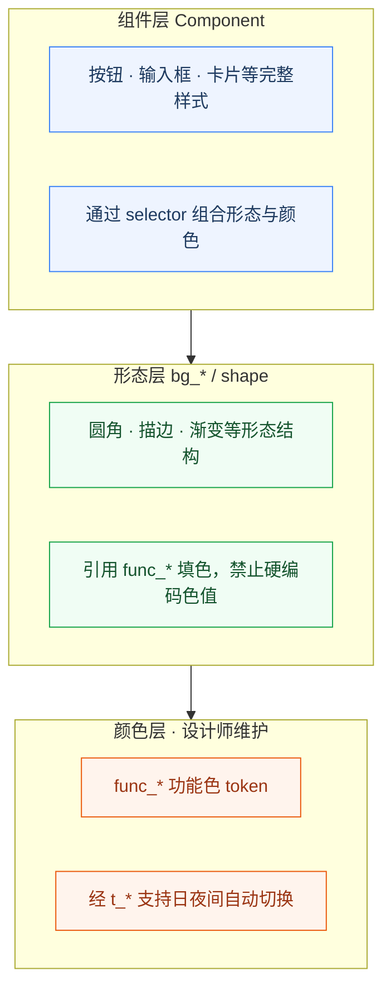
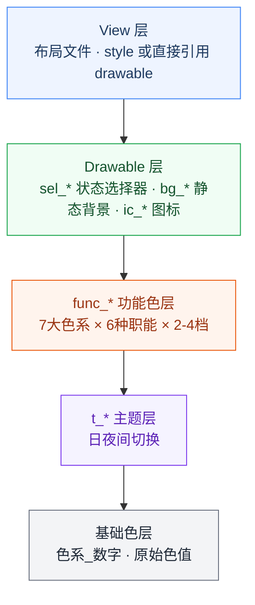

# 现代化 UI 架构：Drawable 层规范与工程实践

> 本文是 UI 架构系列的第二篇，建议先阅读 [第一篇：三层颜色体系与系统化设计方案](ui_architecture1.md) 了解核心设计理念。

---

## 前言

在上一篇文章中，我们建立了一套完整的颜色体系。但颜色只是 UI 的基础，真正让 UI 活起来的是**形态和交互**。

一个按钮不仅需要颜色，还需要：
- 圆角、描边、阴影
- 按下、禁用、选中的状态变化
- 渐变、透明等视觉效果

这些都需要通过 Drawable 来实现。

> **贯穿 UI 架构层的一条铁律**：颜色、Drawable、Style 等所有资源定义，**都不要和业务挂钩**；命名表达的是 **UI 职能**，**职能 ≠ 业务**。一旦用「登录页按钮」「订单失败红框」这类业务语义去命名或拆分资源，就等于把形态和颜色锁死在某个页面——**可复用性会被立刻破坏**。Drawable 层只描述形态、色系、交互状态与档位，业务含义由使用它的页面自己承担。

> **跨平台**：Android 的 Drawable/selector 对应 iOS 的 Asset Catalog 状态图、Web 的 design-token + CSS 状态类；命名与分层思想一致。

**本文要点**：
1. 为什么需要 Drawable 层规范
2. Drawable 层的三层架构设计
3. 统一的命名规范
4. 形态层和组件层的设计要点

---

## 一、为什么需要 Drawable 层规范？

### 1.1 反例：混乱的 Drawable 管理

在我接触过的项目中，经常会看到这样的 Drawable 定义：

```xml
<!-- btn_primary.xml -->
<shape>
    <solid android:color="#FF4B00" />
    <corners android:radius="24dp" />
</shape>

<!-- btn_primary_pressed.xml -->
<shape>
    <solid android:color="#CC3D00" />
    <corners android:radius="24dp" />
</shape>

<!-- btn_disabled.xml -->
<shape>
    <solid android:color="#CCCCCC" />
    <corners android:radius="24dp" />
</shape>
```

### 1.2 问题分析

| 问题类型 | 具体表现 | 影响 |
|---------|---------|------|
| **重复定义** | 每个状态都要单独定义一个文件 | 维护成本高 |
| **颜色硬编码** | 直接写色值，无法跟随主题切换 | 主题适配困难 |
| **命名混乱** | `btn_primary`、`button_normal` 等命名不统一 | 新人难以选择 |
| **难以维护** | 改一个圆角需要修改所有文件 | 修改成本高 |

### 1.3 根本原因

这些问题的本质在于：**形态定义与颜色、状态过度耦合**。当一个 Drawable 文件同时承载了形状、颜色和状态逻辑时，任何改动都会变得非常困难。

---

## 二、Drawable 层的三层架构

借鉴颜色体系的设计思路，我们同样采用**三层架构**来管理 Drawable：



### 2.1 核心原则

| 层级 | 职责 | 特点 |
|------|------|------|
| **组件层** | 组合状态和形态 | 通过 selector 引用 bg_*，实现状态切换 |
| **形态层** | 定义圆角、描边、填充结构 | 颜色只引用 `func_*`，禁止硬编码色值 |
| **颜色层** | 提供颜色 token | 设计师维护的功能色，支持主题切换 |

**与业务解耦**：三层都只表达「UI 语言」，不表达「业务故事」。`sel_orange_interact_capsule_emphasis_default` 可以在下单主按钮、会员开通按钮、活动页主按钮上复用；若做成 `sel_order_submit_primary`，换页面就要复制一套 Drawable，主题与形态也无法在全 App 统一维护。

---

## 三、命名规范：让每个文件都有明确的含义

### 3.1 命名公式

```
{类型}_{色系}_{用途}_{状态}_{档位}
```

### 3.2 组成说明

| 组成部分 | 说明 | 允许值 |
|---------|------|--------|
| **类型** | Drawable 类别 | `bg`（背景）、`sel`（选择器）、`ic`（图标） |
| **色系** | 颜色分类 | `gray`、`orange`、`red`、`blue`、`green`、`black`、`white` |
| **用途** | 使用场景 | `surface`、`fill`、`stroke`、`field`、`interact`、`gradient` |
| **状态** | 交互状态 | `idle`、`alert`、`hint`、`emphasis`、`neutral`、`default` |
| **档位** | 优先级 | 数字 `1`（主要）、`2`（次要）、`3`（第三） |

### 3.3 命名示例

```
bg_orange_fill_interact_1    // 橙色交互填充背景，主档位
bg_gray_surface_card_1       // 灰色卡片表面背景
sel_orange_interact_outline_emphasis_default  // 橙色描边交互选择器
bg_black_fill_scrim_1        // 黑色遮罩填充
```

### 3.4 反例：业务绑定如何毁掉复用

```
❌ 错误：文件名承载业务，无法跨场景复用
bg_login_page_primary_btn.xml
bg_order_detail_pay_btn.xml
sel_profile_avatar_upload_error.xml
```

三个文件往往只是圆角、色值、状态略有相似，却无法合并维护。正确做法是共用 `sel_orange_interact_capsule_emphasis_default` 等**职能 + 形态**命名，由不同页面的布局或 Style 决定用在哪里。

---

## 四、形态层设计：结构 + 功能色引用

### 4.1 基础形状类型

| 形状 | 用途 | 示例 |
|------|------|------|
| **fill** | 实心填充 | 按钮背景、卡片背景 |
| **stroke** | 描边空心 | 输入框边框、幽灵按钮 |
| **flat** | 扁平透明 | 文字按钮、点击区域 |
| **gradient** | 渐变效果 | 渐变背景、光晕效果 |
| **surface** | 表面效果 | 卡片、浮层、阴影 |

### 4.2 形状定义规范

```xml
<!-- bg_orange_fill_interact_1.xml -->
<shape xmlns:android="http://schemas.android.com/apk/res/android"
    android:shape="rectangle">
    <solid android:color="@color/func_orange_bg_1" />
    <corners android:radius="@dimen/draw_corner_capsule" />
</shape>

<!-- bg_orange_stroke_interact_1.xml -->
<shape xmlns:android="http://schemas.android.com/apk/res/android"
    android:shape="rectangle">
    <solid android:color="@color/func_clear_1" />  <!-- 透明填充 -->
    <stroke 
        android:width="@dimen/draw_stroke_reg" 
        android:color="@color/func_orange_border_1" />
    <corners android:radius="@dimen/draw_corner_capsule" />
</shape>
```

**关键设计点**：
- 使用 `@dimen` 引用尺寸（由设计师在 dimens 中定义），避免硬编码
- 使用 `@color/func_*` 引用功能色，支持主题切换；**禁止**在 drawable 中写 `#RRGGBB` 或直接引用 `t_*`、基础色
- 同一套圆角/描边结构可搭配不同色系的功能色，由设计师在 token 层切换映射

---

## 五、状态色设计：状态逻辑放在 Drawable 层

在设计这套体系时，我们曾讨论过是否需要添加「禁用态」「选中态」「按下态」等状态相关的颜色到颜色层。

**结论：状态色应该放在 drawable 层**，而不是颜色层。

| 状态类型 | 建议位置 | 原因 |
|----------|----------|------|
| **禁用态** | drawable层 | 通过selector组合实现 |
| **选中态** | drawable层 | 通过selector组合实现 |
| **按下态** | drawable层 | 通过selector组合实现 |

### 5.1 为什么不在颜色层定义状态色？

1. **职责分离**：颜色层负责提供「原料」，drawable层负责组合「成品」
2. **灵活性**：同一个颜色可以在不同状态下有不同表现
3. **可复用性**：一套颜色可以组合出多种状态效果

### 5.2 状态效果的正确实现方式

```xml
<!-- drawable/sel_orange_interact_capsule_emphasis_default.xml -->
<selector xmlns:android="http://schemas.android.com/apk/res/android">
    <!-- 禁用态 -->
    <item android:state_enabled="false">
        <shape>
            <solid android:color="@color/func_black_bg_2" />  <!-- 禁用态用灰色背景 -->
            <corners android:radius="24dp" />
        </shape>
    </item>
    <!-- 按下态 -->
    <item android:state_pressed="true">
        <shape>
            <solid android:color="@color/func_orange_bg_2" />  <!-- 按下态用浅色 -->
            <corners android:radius="24dp" />
        </shape>
    </item>
    <!-- 常态 -->
    <item>
        <shape>
            <solid android:color="@color/func_orange_bg_1" />  <!-- 常态用主色 -->
            <corners android:radius="24dp" />
        </shape>
    </item>
</selector>
```

---

## 六、组件层设计：状态组合

### 6.1 Selector 的规范写法

```xml
<!-- sel_orange_interact_capsule_emphasis_default.xml -->
<selector xmlns:android="http://schemas.android.com/apk/res/android">
    <!-- 禁用态 -->
    <item 
        android:drawable="@drawable/bg_gray_fill_interact_2" 
        android:state_enabled="false" />
    <!-- 按下态 -->
    <item 
        android:drawable="@drawable/bg_orange_fill_interact_2" 
        android:state_pressed="true" />
    <!-- 常态 -->
    <item android:drawable="@drawable/bg_orange_fill_interact_1" />
</selector>
```

### 6.2 状态优先级

Selector 中状态判断优先级（**高 → 低**）：**禁用态** > **选中态** > **按下态** > **焦点态** > **常态**

### 6.3 输入框状态示例

```xml
<!-- sel_gray_field_rect_idle_default.xml -->
<selector xmlns:android="http://schemas.android.com/apk/res/android">
    <item 
        android:drawable="@drawable/bg_gray_field_rect_2" 
        android:state_enabled="false" />
    <item 
        android:drawable="@drawable/bg_blue_field_rect_1" 
        android:state_focused="true" />
    <item android:drawable="@drawable/bg_gray_field_rect_1" />
</selector>
```

---

## 七、常用组件的 Drawable 实现

### 7.1 按钮组件

| 按钮类型 | Drawable 配置 |
|---------|--------------|
| **主按钮** | `sel_orange_interact_capsule_emphasis_default` |
| **次按钮** | `sel_gray_interact_capsule_neutral_default` |
| **文字按钮** | `sel_gray_interact_flat_neutral_default` |
| **幽灵按钮** | `sel_orange_interact_outline_emphasis_default` |

### 7.2 输入框组件

| 状态 | Drawable 配置 |
|------|--------------|
| **常态** | `sel_gray_field_rect_idle_default` |
| **警告态** | `sel_yellow_field_rect_hint_static` |
| **错误态** | `sel_red_field_rect_alert_static` |

### 7.3 卡片组件

| 卡片类型 | Drawable 配置 |
|---------|--------------|
| **普通卡片** | `bg_gray_surface_card_1` |
| **浮层卡片** | `bg_gray_surface_float_1` |
| **面板卡片** | `bg_gray_surface_panel_1` |

---

## 八、尺寸管理：统一的 Dimen 规范

### 8.1 圆角尺寸

```xml
<!-- dimens_drawable.xml -->
<dimen name="draw_corner_none">0dp</dimen>
<dimen name="draw_corner_sm">4dp</dimen>
<dimen name="draw_corner_reg">8dp</dimen>
<dimen name="draw_corner_lg">12dp</dimen>
<dimen name="draw_corner_capsule">999dp</dimen>  <!-- 胶囊形 -->
```

### 8.2 描边尺寸

```xml
<dimen name="draw_stroke_thin">0.5dp</dimen>
<dimen name="draw_stroke_reg">1dp</dimen>
<dimen name="draw_stroke_thick">2dp</dimen>
```

### 8.3 阴影尺寸

```xml
<dimen name="draw_shadow_elevation_1">2dp</dimen>
<dimen name="draw_shadow_elevation_2">4dp</dimen>
<dimen name="draw_shadow_elevation_3">8dp</dimen>
```

---

## 九、与颜色体系的集成

### 9.1 颜色引用规范

```xml
<!-- ✅ 正确：引用功能色层 -->
<solid android:color="@color/func_orange_bg_1" />
<stroke android:color="@color/func_orange_border_1" />

<!-- ❌ 错误：直接引用主题色或基础色 -->
<solid android:color="@color/t_orange_4" />  <!-- 不推荐 -->
<solid android:color="@color/orange_4" />    <!-- 禁止 -->
```

### 9.2 夜间模式自动适配

得益于三层颜色架构，Drawable 层**无需任何修改**即可支持夜间模式：

```
日间模式：
func_orange_bg_1 → t_orange_4 → orange_4 (#FF4B00)

夜间模式：
func_orange_bg_1 → t_orange_4 → orange_3b (#FF8833)
```

---

## 十、与 View 的集成方式

### 10.1 通过 Style 引用

```xml
<!-- styles_button.xml -->
<style name="Btn.Orange.Capsule.Emphasis" parent="BaseButton">
    <item name="android:background">@drawable/sel_orange_interact_capsule_emphasis_default</item>
    <item name="android:textColor">@color/func_white_text_1</item>
</style>
```

### 10.2 在布局中直接使用

```xml
<Button
    android:layout_width="match_parent"
    android:layout_height="wrap_content"
    android:background="@drawable/sel_orange_interact_capsule_emphasis_default"
    android:text="主操作" />
```

---

## 十一、完整架构总结



---

## 十二、总结

Drawable 层是连接颜色和 UI 组件的桥梁，它的设计直接影响到：
- UI 的一致性和美观度
- 代码的可维护性
- 主题切换的灵活性

通过遵循以下原则，你可以构建一套优秀的 Drawable 体系：

1. **与业务解耦**：Drawable 只表达形态与交互语义，绝不使用页面名、流程名、业务事件名
2. **分离关注点**：形态结构与填色引用分离，状态组合与组件分离
3. **统一命名规范**：`{类型}_{色系}_{用途}_{状态}_{档位}`
4. **复用优先**：避免重复定义，提高资源利用率
5. **与颜色体系集成**：只引用设计师定义的 `func_*`，支持主题切换

---

**参考代码**：
- [Drawable 资源目录](https://github.com/zealot2002/arch_ui_token_spec/tree/main/app/src/main/res/drawable)
- [样式定义](https://github.com/zealot2002/arch_ui_token_spec/blob/main/app/src/main/res/values/styles_button.xml)
- [尺寸定义](https://github.com/zealot2002/arch_ui_token_spec/blob/main/app/src/main/res/values/dimens_drawable.xml)

> 💡 如果你觉得这篇文章对你有帮助，欢迎点赞、收藏、转发。关注我，获取更多 Android 架构设计干货。
>
> **系列文章**：
> - [第一篇：三层颜色体系与系统化设计方案](ui_architecture1.md)
> - **第二篇：Drawable 层规范与工程实践**（本文）
> - [第三篇：Style 层如何系统性消除代码冗余](ui_architecture3.md)
> - [第四篇：设计主权回归与团队落地](ui_architecture4.md)