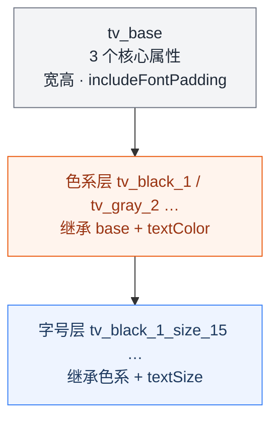
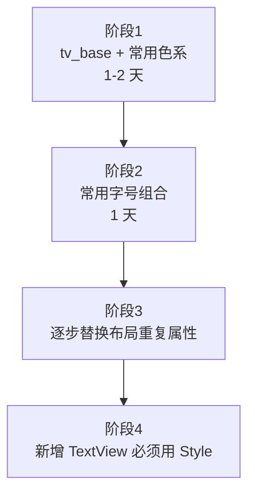

# 现代化 UI 架构：Style 层如何系统性消除代码冗余

> 本文是 UI 架构系列的第三篇，建议先阅读 [第一篇：三层颜色体系与系统化设计方案](ui_architecture1.md)、[第二篇：Drawable 层规范与工程实践](ui_architecture2.md) 了解核心设计理念。

---

## 前言

在多年的 Android 开发实践中，我发现一个普遍存在的问题：**TextView 的属性定义存在大量重复**。

打开任何一个中等规模的 Android 项目，你会发现几乎每个布局文件中都有类似这样的代码：

```xml
<TextView
    android:layout_width="wrap_content"
    android:layout_height="wrap_content"
    android:textColor="@color/black"
    android:textSize="15sp"
    android:includeFontPadding="false"
    android:text="商品名称" />
```

这些属性被重复定义了成千上万次。想象一下：如果你有 500 个 TextView，有一天设计师说所有文字的字号要统一从 15sp 改成 16sp，或者要关闭字体内边距，你需要打开 500 个文件逐个修改——这简直是噩梦。

我们分析了大量项目中的 TextView 使用情况，遵从 98% 的 TextView 的共性，提炼出 **3 个**必须封装进 `tv_base` 的基础属性（宽高、`includeFontPadding`）。

**Style 层的核心价值**：由设计师在 `styles_tv.xml`、`styles_button.xml` 中定义文字与按钮的**职能化**样式，研发在布局里只引用 `tv_*`、`Btn.*`，不再自行决定 `textColor` / `textSize` / 按钮形态。

> **职能 ≠ 业务（系列铁律）**：`tv_black_1_size_15`、`Btn.Orange.Capsule.Emphasis` 命名的是**色系 + 文本层级 / 按钮形态 + 交互档位**等 UI 职能，不是「商品标题」「下单支付」等业务场景。业务只决定**在哪个页面引用哪条职能样式**，不应反过来用业务名定义 Style——否则全公司都会陷入「每个页面一套按钮 Style、改主题改到崩溃」的通病。

> **跨平台**：`tv_*` / `Btn.*` 对应 iOS 的 `UIFont`+语义色组合、Web 的 typography utility class；同样应由设计系统维护，研发只引用。

---

## 一、工程实践中的痛点：TextView 属性冗余

### 1.1 统计数据：一个中等项目的属性重复情况

根据我们对多个项目的分析，一个包含 100 个 Activity/Fragment 的项目：
- 平均每个布局文件有 5-10 个 TextView
- 每个 TextView 平均定义 3-5 个重复属性
- **总重复次数超过 2000 次**

### 1.2 典型的重复模式

```xml
<!-- 模式1：每个 TextView 都重复写宽高 -->
<TextView android:layout_width="wrap_content" />
<TextView android:layout_width="wrap_content" />
<TextView android:layout_width="wrap_content" />

<!-- 模式2：每个 TextView 都要设置 includeFontPadding -->
<TextView android:includeFontPadding="false" />
<TextView android:includeFontPadding="false" />
<TextView android:includeFontPadding="false" />

<!-- 模式3：颜色和字号的组合重复 -->
<TextView android:textColor="@color/black" android:textSize="15sp" />
<TextView android:textColor="@color/black" android:textSize="15sp" />
<TextView android:textColor="@color/black" android:textSize="15sp" />
```

### 1.3 维护成本分析

| 场景 | 无 Style | 有 Style | 节省比例 |
|------|---------|---------|---------|
| 修改默认宽高 | 需要修改所有文件 | 修改一处 | ~99% |
| 修改 includeFontPadding | 需要修改所有文件 | 修改一处 | ~99% |
| 修改字号 | 需要修改所有文件 | 修改一处 | ~99% |
| 修改颜色主题 | 需要修改所有文件 | 修改一处 | ~99% |

---

## 二、经验总结：TextView 必须的 3 个基础属性

经过多个大型项目的实践验证，我们总结出 **TextView 必须定义的 3 个基础属性**：

```xml
<style name="tv_base">
    <item name="android:layout_width">wrap_content</item>
    <item name="android:layout_height">wrap_content</item>
    <item name="android:includeFontPadding">false</item>
</style>
```

### 2.1 为什么是这 3 个？

| 属性 | 必要性 | 工程经验 |
|------|---------|---------|
| `layout_width="wrap_content"` | **必须** | 95% 的 TextView 不需要撑满一行，需要时在布局中覆盖 |
| `layout_height="wrap_content"` | **必须** | 文字高度应由内容决定，避免固定高度导致截断 |
| `includeFontPadding="false"` | **必须** | Android 默认字体有额外内边距，导致垂直居中困难 |

### 2.2 为什么不再多定义一些？

```xml
<!-- ❌ 不推荐：在 base 中定义过多属性 -->
<style name="tv_base_bad">
    <item name="android:layout_width">wrap_content</item>
    <item name="android:layout_height">wrap_content</item>
    <item name="android:includeFontPadding">false</item>
    <item name="android:textColor">@color/black</item>  <!-- 不应该在这里定义 -->
    <item name="android:textSize">15sp</item>           <!-- 不应该在这里定义 -->
</style>
```

**原因**：
- **正交性原则**：颜色和字号是正交的属性，应该分开定义
- **组合灵活性**：不同场景需要不同的颜色+字号组合
- **单一职责**：base 只负责"通用基础属性"，不负责"业务属性"

---

## 三、正交组合：颜色 × 字号 的高效复用

### 3.1 设计思路



### 3.2 色系层定义

```xml
<!-- 黑色系（主文本） -->
<style name="tv_black_1" parent="tv_base">
    <item name="android:textColor">@color/func_black_text_1</item>
</style>
<style name="tv_black_2" parent="tv_base">
    <item name="android:textColor">@color/func_black_text_2</item>
</style>

<!-- 灰色系（辅助文本） -->
<style name="tv_gray_1" parent="tv_base">
    <item name="android:textColor">@color/func_gray_text_1</item>
</style>
<style name="tv_gray_2" parent="tv_base">
    <item name="android:textColor">@color/func_gray_text_2</item>
</style>

<!-- 橙色系（强调文本） -->
<style name="tv_orange_1" parent="tv_base">
    <item name="android:textColor">@color/func_orange_text_1</item>
</style>
```

### 3.3 字号层定义

```xml
<!-- 黑色主文本 + 各种字号 -->
<style name="tv_black_1_size_12" parent="tv_black_1">
    <item name="android:textSize">12sp</item>
</style>
<style name="tv_black_1_size_14" parent="tv_black_1">
    <item name="android:textSize">14sp</item>
</style>
<style name="tv_black_1_size_15" parent="tv_black_1">
    <item name="android:textSize">15sp</item>
</style>
<style name="tv_black_1_size_16" parent="tv_black_1">
    <item name="android:textSize">16sp</item>
</style>

<!-- 灰色辅助文本 + 常用字号 -->
<style name="tv_gray_2_size_12" parent="tv_gray_2">
    <item name="android:textSize">12sp</item>
</style>
<style name="tv_gray_2_size_14" parent="tv_gray_2">
    <item name="android:textSize">14sp</item>
</style>
```

**屏幕适配优势**：这种集中定义的方式还有一个重要好处——便于屏幕适配。如果有一天需要支持多尺寸屏幕，只需将硬编码的 `15sp` 修改为 `@dimen/size_15`，然后在不同的 dimens 文件中定义不同的值即可，整个改动只需要修改 tv style 这一个文件。

### 3.4 组合效果

| 颜色层 | 字号层 | 组合结果 | 用途 |
|------|-------|---------|------|
| `tv_black_1` | `size_15` | `tv_black_1_size_15` | 商品标题、主要内容 |
| `tv_black_2` | `size_13` | `tv_black_2_size_13` | 副标题、次要内容 |
| `tv_gray_2` | `size_12` | `tv_gray_2_size_12` | 提示文字、辅助说明 |
| `tv_orange_1` | `size_14` | `tv_orange_1_size_14` | 强调文字、按钮文字 |

---

## 四、按钮 Style：同样的思路，不同的属性

Button Style 是「业务绑定」的重灾区。很多中大型团队的项目里，你会看到 `BtnLoginSubmit`、`BtnOrderPay`、`BtnMemberOpen` 并排存在——它们往往只是胶囊主按钮的重复拷贝，圆角、字重、背景几乎一样，却**无法复用、无法统一换肤、无法做全 App 主题**。这是业内极其普遍的痛点；根因同样是把 **业务名当成了 Style 名**，而正确的命名只能落在 **职能** 上：主操作、次操作、描边强调、小尺寸等。

### 4.1 按钮必须的基础属性

```xml
<style name="BaseButton" parent="android:Widget.Button">
    <item name="android:textSize">15sp</item>
    <item name="android:textStyle">bold</item>
    <item name="android:letterSpacing">0.02</item>
    <item name="android:gravity">center</item>
    <item name="android:minHeight">48dp</item>
    <item name="android:paddingLeft">24dp</item>
    <item name="android:paddingRight">24dp</item>
</style>
```

### 4.2 按钮属性分析

| 属性 | 必要性 | 工程经验 |
|------|---------|---------|
| `textSize=15sp` | **必须** | 按钮文字需要足够大，保证可点击性 |
| `textStyle=bold` | **必须** | 按钮需要视觉强调，加粗效果更好 |
| `letterSpacing=0.02` | **必须** | 适当增加字间距提升可读性 |
| `minHeight=48dp` | **必须** | 符合 Material Design 规范，保证点击区域 |
| `paddingLeft/Right=24dp` | **必须** | 左右内边距保证文字不贴边 |

### 4.3 按钮的正交组合

```xml
<!-- 胶囊按钮 -->
<style name="Btn.Orange.Capsule.Emphasis" parent="BaseButton">
    <item name="android:background">@drawable/sel_orange_interact_capsule_emphasis_default</item>
    <item name="android:textColor">@color/func_white_text_1</item>
</style>

<style name="Btn.Gray.Capsule.Neutral" parent="BaseButton">
    <item name="android:background">@drawable/sel_gray_interact_capsule_neutral_default</item>
    <item name="android:textColor">@color/func_black_text_1</item>
</style>

<!-- 小尺寸按钮 -->
<style name="Btn.Orange.Capsule.Small" parent="BaseButton">
    <item name="android:minHeight">36dp</item>
    <item name="android:textSize">13sp</item>
    <item name="android:paddingLeft">16dp</item>
    <item name="android:paddingRight">16dp</item>
    <item name="android:background">@drawable/sel_orange_interact_capsule_emphasis_default</item>
    <item name="android:textColor">@color/func_white_text_1</item>
</style>

<!-- 描边按钮 -->
<style name="Btn.Orange.Outline.Emphasis" parent="BaseButton">
    <item name="android:background">@drawable/sel_orange_interact_outline_emphasis_default</item>
    <item name="android:textColor">@color/func_orange_text_1</item>
</style>
```

`Btn.Orange.Capsule.Emphasis` 表达的是**橙色 + 胶囊形态 + 强调档位**，与 Drawable `sel_orange_interact_capsule_emphasis_default` 同序（色系在前）；登录页、收银台、活动页主按钮都可引用，**不要把业务写进 Style 名**。

### 4.4 反例：业务型 Button Style 如何毁掉复用

```
❌ 错误：Style 名承载业务
Btn.Login.Submit
Btn.Order.ConfirmPay
Btn.Profile.EditSave
Btn.Cart.CheckoutNow
```

看似清晰，实则每个业务线各维护一套「主按钮」，设计改一版主色或圆角，要改几十个 Style、走查几十个页面。正确做法是收敛到 `Btn.Orange.Capsule.Emphasis`、`Btn.Gray.Capsule.Neutral`、`Btn.Orange.Outline.Emphasis` 等**职能命名**（**色系在形状之前**），与 Drawable `sel_orange_interact_capsule_emphasis_default` 字段顺序一致。

| 维度 | 业务命名 | 职能命名 |
|------|----------|----------|
| 回答的问题 | 这是哪个页面的按钮？ | 这是什么形态、什么强调级别的按钮？ |
| 能否跨页面复用 | ❌ 基本不能 | ✅ 全 App 复用 |
| 主题/品牌升级 | 改多处、易遗漏 | 改 Style + token 即可 |
| 典型名称 | `BtnOrderPay` | `Btn.Orange.Capsule.Emphasis` |

---

## 五、复用效果对比

### 5.1 改造前：每个 TextView 都要写完整属性

```xml
<!-- 改造前：每个都要写 4-5 行 -->
<TextView
    android:layout_width="wrap_content"
    android:layout_height="wrap_content"
    android:includeFontPadding="false"
    android:textColor="@color/func_black_text_1"
    android:textSize="15sp"
    android:text="商品名称" />

<TextView
    android:layout_width="wrap_content"
    android:layout_height="wrap_content"
    android:includeFontPadding="false"
    android:textColor="@color/func_gray_text_2"
    android:textSize="12sp"
    android:text="库存紧张" />

<TextView
    android:layout_width="wrap_content"
    android:layout_height="wrap_content"
    android:includeFontPadding="false"
    android:textColor="@color/func_red_text_1"
    android:textSize="14sp"
    android:text="¥299" />
```

### 5.2 改造后：一行解决

```xml
<!-- 改造后：只需引用 style -->
<TextView
    style="@style/tv_black_1_size_15"
    android:text="商品名称" />

<TextView
    style="@style/tv_gray_2_size_12"
    android:text="库存紧张" />

<TextView
    style="@style/tv_red_1_size_14"
    android:text="¥299" />
```

### 5.3 量化对比

| 指标 | 改造前 | 改造后 | 节省比例 |
|------|-------|-------|---------|
| 代码行数（3个TextView） | 15 行 | 6 行 | **60%** |
| 属性定义次数 | 12 次 | 0 次 | **100%** |
| 维护点 | 每个 TextView | 1 个 Style 文件 | **99%** |

---

## 六、命名规范：让复用更直观

### 6.1 文字 Style 命名

```
tv_{色系}_{档位}_size_{字号}
```

**示例**：
- `tv_black_1_size_15`：黑色主文本，15sp
- `tv_gray_2_size_12`：灰色辅助文本，12sp
- `tv_orange_1_size_14`：橙色强调文本，14sp

### 6.2 按钮 Style 命名

```
Btn.{色系}.{形状}.{交互档位}[.Small]
```

**示例**（与 Drawable `sel_{色系}_…` 一致，**色系紧挨 Btn 前缀**）：
- `Btn.Orange.Capsule.Emphasis`：橙色胶囊强调按钮
- `Btn.Gray.Capsule.Neutral`：灰色胶囊中性按钮
- `Btn.Orange.Outline.Emphasis`：橙色描边强调按钮
- `Btn.Orange.Capsule.Small`：橙色胶囊小尺寸

### 6.3 命名原则

1. **职能语义，而非业务语义**：`Orange` / `Emphasis` / `black_1` 描述的是色系与 UI 档位，不是订单、登录、会员等业务模块
2. **层次清晰**：`tv_{色系}_{档位}`；`Btn_{色系}_{形状}_{档位}`，色系位置与颜色层、Drawable 层对齐
3. **易于搜索**：统一前缀便于 IDE 搜索；全团队共用同一套职能 Style，而不是每人发明业务名

---

## 七、与颜色体系的集成

### 7.1 完整数据流

```mermaid
flowchart TB
    TV["tv_black_1_size_15"]
    TV1["tv_black_1"]
    FC["func_black_text_1"]
    T["t_black_8"]
    B["black_8"]
    SZ["textSize 15sp"]

    TV --> TV1
    TV --> SZ
    TV1 -->|textColor| FC --> T --> B

    classDef style fill:#EEF4FF,stroke:#3B82F6,color:#1E3A5F
    classDef func fill:#FFF4ED,stroke:#EA580C,color:#9A3412
    classDef theme fill:#F5F3FF,stroke:#7C3AED,color:#5B21B6
    classDef base fill:#F3F4F6,stroke:#6B7280,color:#1F2937
    class TV,TV1 style
    class FC func
    class T theme
    class B base
```

### 7.2 主题切换支持

由于 Style 通过 `@color/func_*` 引用功能色，而功能色又通过 `@color/t_*` 引用主题色，所以：

- **日间**：`tv_black_1_size_15` → `func_black_text_1` → `t_black_8` → `black_8`
- **夜间**：`tv_black_1_size_15` → `func_black_text_1` → `t_black_8` → `white_1`（由 `values-night` 中 `t_*` 映射决定）

**无需修改任何 Style，自动适配主题**。

---

## 八、实际项目中的最佳实践

### 8.1 渐进式改造



### 8.2 团队协作规范

1. 所有新增 TextView 必须使用设计师定义的 `tv_*` Style
2. 禁止在布局中直接定义 `textColor`、`textSize`、`includeFontPadding`
3. 需要新的颜色+字号组合时，由设计师在 `styles_tv.xml` 中新增，研发提需求、不自行加 token
4. 定期审查，清理直接定义属性的代码

### 8.3 扩展原则

| 场景 | 做法 |
|------|------|
| 需要新字号 | 设计师在对应色系下添加（如 `tv_black_1_size_17`） |
| 需要新色系 | 设计师先补功能色，再添加 `tv_purple_1` 及字号组合 |
| 需要特殊效果 | 优先在设计规范中沉淀；确属个例时可在布局用 `textStyle` 等覆盖 |

---

## 九、总结

Style 层不是简单的"属性集合"，而是**工程经验的沉淀和复用**。

### 核心价值

1. **消除冗余**：将重复属性抽取到 Style 中，写一次用无数次
2. **统一标准**：通过 tv_base 确保所有 TextView 有一致的基础行为
3. **降低维护成本**：修改一处，全局生效
4. **支持主题切换**：与颜色体系无缝集成

### 关键设计原则

1. **职能 ≠ 业务**：Style 只命名 UI 职能；业务场景只选择引用哪条 Style
2. **最小化基础层**：tv_base 只定义 3 个必须属性
3. **正交组合**：颜色和字号分开定义，灵活组合
4. **按钮同样职能化**：`Btn.Orange.Capsule.Emphasis` 等全 App 复用，禁止 `BtnXxxBusiness` 式命名

### 预期收益

根据我们的实践经验，引入 Style 层后：
- **代码量减少 30-50%**（布局文件）
- **维护时间减少 80%**（属性修改）
- **视觉一致性提升**（避免手动书写错误）

---

**参考代码（与本文配套的实现仓库一致）**：
- [文字样式定义](https://github.com/zealot2002/arch_ui_token_spec/blob/main/app/src/main/res/values/styles_tv.xml)
- [按钮样式定义](https://github.com/zealot2002/arch_ui_token_spec/blob/main/app/src/main/res/values/styles_button.xml)
- [颜色资源](https://github.com/zealot2002/arch_ui_token_spec/tree/main/app/src/main/res/values)

> 💡 如果你觉得这篇文章对你有帮助，欢迎点赞、收藏、转发。关注我，获取更多Android架构设计干货。
>
> **系列文章**：
> - [第一篇：三层颜色体系与系统化设计方案](ui_architecture1.md)
> - [第二篇：Drawable 层规范与工程实践](ui_architecture2.md)
> - **第三篇：Style 层如何系统性消除代码冗余**（本文）
> - [第四篇：设计主权回归与团队落地](ui_architecture4.md)