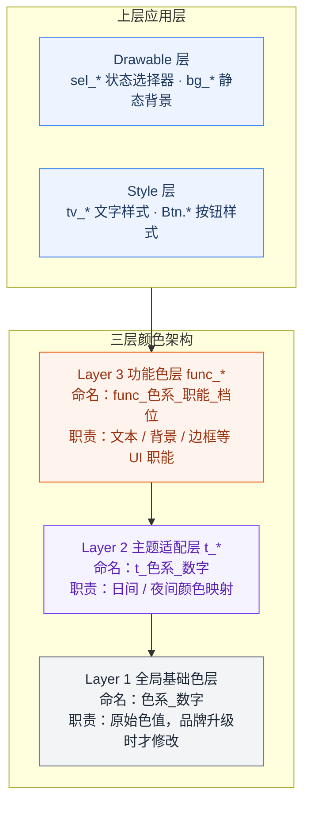
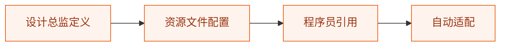
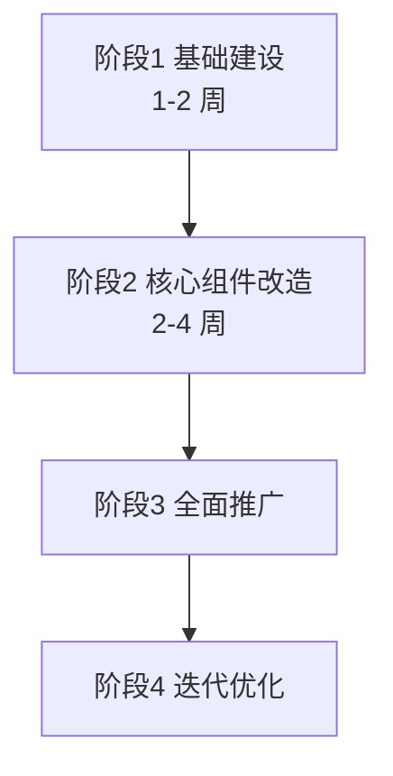

# UI架构体系总结：从代码到设计的权力回归

> 本文是 UI 架构系列的第四篇，也是最后一篇。建议先阅读 [第一篇：三层颜色架构](ui_architecture1.md)、[第二篇：Drawable 层设计](ui_architecture2.md)、[第三篇：Style 层设计](ui_architecture3.md) 了解完整架构体系。

---

## 一、架构全景：

在前面三篇文章中，我们构建了一套完整的 UI 资源架构体系：



### 1.1 架构的核心价值

| 层级 | 核心价值 | 解决的问题 |
|------|---------|-----------|
| **Style** | 消除冗余，提升复用 | 重复属性定义 |
| **Drawable** | 统一形态，状态管理 | 视觉不一致 |
| **Func_*** | 语义抽象，职能归一 | 颜色滥用 |
| **基础色+主题** | 主题切换，灵活适配 | 多模式支持 |

### 1.2 Demo 的局限性

需要说明的是，本仓库中的 demo 仅作为**抛砖引玉**：
- **颜色覆盖**：只实现了常用 token 子集；矩阵补全、新增档位均由**设计师**在资源文件中维护，研发不自行扩展
- **Drawable 资源**：仅实现了按钮、输入框等基础组件的状态，实际项目会更复杂
- **组件覆盖**：demo 只展示了文字和按钮，实际还需要扩展到卡片、列表、弹窗等

这套架构的真正价值在于**方法论**，而非具体实现。

---

## 二、深度思考：UI 架构的权力究竟属于谁？

### 2.1 一个尖锐的问题

> **UI 架构的权力究竟属于设计师还是属于程序员？**

这个问题困扰了无数团队。让我们从几个角度分析：

| 角色 | 优势 | 劣势 |
|------|------|------|
| **顶尖设计师** | 具备专业视觉素养，理解设计语言，追求极致细节 | 对技术实现边界不了解，难以落地 |
| **程序员** | 懂技术实现，能落地，但良莠不齐 | 缺乏设计专业训练，视觉敏感度不足 |

### 2.2 现实的困境

在大多数公司，现状是：
1. **设计师设计稿** → 精心设计的颜色、间距、阴影
2. **研发实现** → 代码实现时可能随意选择颜色、调整尺寸
3. **反复 UI 走查** → 发现偏差，返工修改
4. **再次走查** → 仍有偏差，继续返工

**这是一个巨大的资源浪费循环。**

### 2.3 浪费有多大？

根据我在多个中等规模项目中的经验，常见情况是：
- **单次 UI 走查**：往往能发现数十处视觉偏差（色值、字号、间距不一致）
- **走查轮次**：往往要 3–5 轮才能收敛
- **每轮修复**：往往占用 1–2 人天研发 + 设计师复核时间

叠加产品经理协调、测试回归、上线推迟，**单个项目就会白白消耗数人天到数十人天**。团队项目一多，这就是持续燃烧的隐性成本。

---

## 三、解决方案：将定义权交还给设计师

### 3.1 架构的使命

这套 UI 架构体系的深层使命，是**将 UI 的定义权从程序员手中重新夺回到设计师手中**。

**核心思路**：
1. **设计语言标准化**：由设计总监定义完整的设计语言
2. **资源文件可配置化**：将设计决策转化为可配置的资源文件（**所有权在设计侧**）
3. **代码引用规范化**：程序员只引用已有 token 与 Style，**无权**自行定义颜色、字号、圆角档位或新增 Style 变体

### 3.2 设计师主导的工作流



**具体实现**：

1. **设计阶段**：设计总监定义设计语言
   - 颜色体系（7大色系 × 6种职能）
   - 文字规范（字号、字重、行高）
   - 间距系统（8dp 栅格）
   - 组件规范（按钮、卡片、输入框）

2. **配置阶段**：将设计语言转化为资源文件
   - `colors_primitives.xml`：基础色定义
   - `colors_theme_tokens.xml`：主题映射
   - `colors_semantic.xml`：功能色定义
   - `styles_tv.xml`：文字样式
   - `styles_button.xml`：按钮样式
   - `drawable/*`：状态选择器

3. **开发阶段**：程序员只需引用
   ```xml
   <TextView style="@style/tv_black_1_size_15" />
   <Button style="@style/Btn.Capsule.Primary" />
   ```

### 3.3 权力回归的意义

| 维度 | 设计师主导 | 程序员主导 |
|------|-----------|-----------|
| **视觉一致性** | 高度一致，符合设计语言 | 参差不齐，取决于个人水平 |
| **设计还原度** | 100% 还原设计意图 | 60-90%，取决于专业能力 |
| **迭代效率** | 改资源文件即可，无需改代码 | 需要修改大量代码 |
| **维护成本** | 低，集中管理 | 高，分散在各处 |

---

## 四、统一架构带来的深远影响

### 4.1 世界级的产品外观

统一的 UI 架构带来的是**世界级的产品外观设计和视觉一致性**。

举个例子：同样是"灰色"，细微的差异就会导致 App 的品质感天差地别：

```
设计稿：gray_2 = #8A8A8A（精心调配的中性灰）
错误实现：gray = #888888（随手写的灰色）
```

这 0.5% 的差异，在用户眼中就是"专业"和"山寨"的区别。

### 4.2 团队协作效率提升

**场景对比**：

| 场景 | 传统方式 | 架构方式 | 效率提升 |
|------|---------|---------|---------|
| 新增页面 | 手动写所有属性 | 引用 style，一行搞定 | 80% |
| 修改主题色 | 修改所有布局文件 | 修改一处资源 | 99% |
| UI 走查修复 | 查找并修改多处 | 资源已定义，无需修改 | 100% |

### 4.3 品牌形象的统一

在多端、多产品线的场景下，统一架构的价值更加凸显：

- **Android/iOS/Web**：使用相同的颜色定义
- **主 App/小程序/H5**：保持一致的视觉风格
- **不同版本**：确保品牌形象的连续性

---

## 五、架构落地的实践建议

### 5.1 渐进式落地策略



### 5.2 团队协作规范

1. 设计规范先行：设计总监必须先定义设计语言
2. 资源配置同步：所有颜色/字号/Style/Drawable 变更仅由设计侧提交资源 PR
3. 代码审查把关：研发 PR 禁止硬编码颜色、尺寸，禁止新增 `func_*` / `tv_*` / `Btn.*`
4. 定期审计：CI 门禁 + 设计走查，发现违规引用一律打回

### 5.3 工具链支持

建议配套以下工具：
- **设计稿标注工具**：Zeplin、Figma 插件
- **资源生成工具**：自动从设计稿生成资源文件
- **代码检查工具**：Lint 规则检查硬编码
- **预览工具**：实时预览主题切换效果

---

## 六、系列文章回顾与总结

### 6.1 四篇文章的核心贡献

| 文章 | 核心内容 | 解决的问题 |
|------|---------|-----------|
| **第一篇** | 三层颜色架构 + 7大色系×6种职能 | 主题切换、颜色一致性、职能 token |
| **第二篇** | Drawable 层设计 | 形态定义、状态管理 |
| **第三篇** | Style 层设计 | 消除冗余、提升复用 |
| **第四篇** | 设计主权回归 + 门禁落地 | 权力边界、规范强制执行 |

### 6.2 架构的核心原则

1. **分层抽象**：从基础色到组件，逐层抽象
2. **语义化命名**：让资源名表达用途，而非具体值
3. **正交组合**：属性分离，灵活组合
4. **集中管理**：资源集中定义，便于维护

### 6.3 最终价值

这套架构体系带来的价值是**系统性的**：

- **对用户**：更一致、更专业的产品体验
- **对设计师**：设计意图得到完整还原
- **对程序员**：减少重复劳动，提升开发效率
- **对公司**：节省大量人力成本，提升品牌形象

---

## 七、结语

UI 架构不是简单的"颜色配置"，而是**设计语言的工程化落地**。

它解决的核心问题是：**如何让设计师的专业决策能够在代码中完整、一致地体现**。

在这个过程中，程序员的角色从「视觉决策者」转变为「实现执行者」：**颜色、字号、样式、按钮形态的定义权完全在设计侧**；程序员的价值体现在正确引用资源、业务逻辑与性能优化——而不是在布局里「顺手改个色」。

希望这套架构体系能够为你的团队带来启发，让我们一起构建更好的产品体验。

### 跨平台适用性与 AI 时代的设计交付

需要强调的是，这套 UI 架构虽然以 Android 作为例子说明，但**核心思想可以完全平移到 iOS、React、H5、小程序等任何平台**。架构的本质是"设计语言的工程化表达"，与具体实现技术无关。

在 AI 大模型的帮助下，设计师可以交付完整的一套 UI 架构。这套架构是 **AI 友好的**——通过合理的 Prompt、设计规范与资源清单，能够快速沉淀全平台统一的设计语言。

最重要的一点：**程序员没有权力定义颜色、样式、字号、按钮，也没有权力「扩展档位」或私自新增 token**。需要新色、新字号、新 Style 时，必须回到设计师维护的资源文件（本体系中的 `colors_*.xml`、`styles_*.xml`、`drawable/`）由设计侧变更，再合入工程。程序员的职责只有一项：**严格引用设计师已发布的资源**，确保设计意图完整落地。

### 规范门禁：让权力回归不只停留在纸面上

架构写得再漂亮，若缺少**可执行的约束**，仍会回到「谁写页面谁说了算」的老路。所谓门禁，并不是为难研发，而是把前文所说的**设计主权**固化进团队的日常流程：该谁定的已经定好，研发只做引用与实现。

#### 建议守住的四条底线

1. **颜色只能来自设计 token**：页面里不应出现随手写的色值，也不应绕过功能色层去碰主题层、基础色。
2. **文字与按钮必须走设计样式**：字号、字色、按钮形态等，应在设计侧资源中选型，而不是在页面里临时拼凑。
3. **禁止重复定义已规范化的属性**：同一类控件的表现，应通过样式体系统一，避免「这个页面特殊、那个页面例外」。
4. **变更入口唯一在设计侧**：需要新色、新档位、新样式时，由设计师更新资源与规范，研发提需求、不自行扩库。

#### 如何落地

- **合并前审查**：把 UI 资源是否符合规范，纳入 Code Review 的固定项；关键版本可由设计同学参与走查或签字。
- **设计资源即唯一真相**：颜色、样式、Drawable 等集中由设计维护的资源包发布，业务工程只依赖已发布版本，避免各端各写一套。
- **自动化作为兜底**：团队可按需要配置静态检查或流水线卡点，但目的始终是**拦截越权定义**，而不是堆砌技术细节。
- **违规即打回**：一旦在页面里发现临时色、临时字号、临时按钮样式，应退回并要求回到设计 token 与样式体系，而不是在评审会上「差不多就行」。

#### 门禁真正要达成的效果

- **设计师的权威性**：视觉语言由设计定义，研发不再充当「第二设计师」。
- **规范的刚性**：越权改动进不了主干，减少靠人记、靠自觉的侥幸。
- **产品的一致性**：用户在不同页面、不同版本里，看到的是同一套品牌与品质感。

门禁不是冷冰冰的流程，而是对前文「权力回归」的**制度保障**。当设计与研发都认同这套边界，UI 走查才会从「找茬大战」变成「按图验收」。

---

**系列文章回顾**：
- [第一篇：三层颜色架构](ui_architecture1.md)
- [第二篇：Drawable 层设计](ui_architecture2.md)
- [第三篇：Style 层设计](ui_architecture3.md)
- **第四篇：架构总结与设计主权回归（本文）**

**参考代码**：
- [完整实现仓库](https://github.com/zealot2002/arch_ui_token_spec)

> 💡 如果这套架构对你有帮助，欢迎点赞、收藏、转发。关注我，获取更多Android架构设计干货。

---